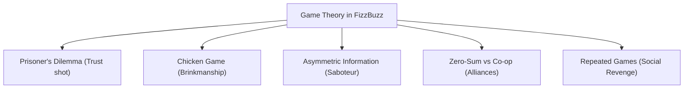

# Game Theory & Player Engagement Strategy

This document outlines the architectural research, mathematical principles, and psychological strategies of **Game Theory** that can be directly applied to the **FizzBuzz Mini Drinking Games** mobile application to maximize player engagement, social friction, and overall product success.

---

## 1. Game Theory 101: Core Concepts & Drinking Game Mappings

Game theory is the study of mathematical models of strategic interaction between rational (and boundedly rational) decision-makers. In a party drinking game context, players are driven by a mix of competitive drive, social capital, avoidance of physical penalty (taking a drink), and the desire to tease their friends.

We can map five classic game-theoretic models directly into core FizzBuzz mechanics:



### A. The Prisoner’s Dilemma (Cooperation vs. Betrayal)

- **The Theory:** Two players can cooperate for mutual benefit, or betray for individual gain. If both betray, they suffer the worst combined outcome.
- **The FizzBuzz Application (The Trust Shot):**
  - Introduce a special mini-game or tie-breaker called **The Trust Shot**. Two players are selected by the app to drink.
  - Secretly on their screens, they must tap either **SHARE** or **STEAL**.
  - **Both choose SHARE:** Both take a small, friendly sip (Cooperation).
  - **One chooses STEAL, other chooses SHARE:** The stealer drinks absolutely nothing; the cooperator must drink the entire cup (Betrayal).
  - **Both choose STEAL:** Both players must drink a double shot (Mutual Defection).
- **Why it Engages:** It creates massive psychological tension, verbal negotiation, and real-life finger-pointing. The social aftermath outlives the game round itself.

### B. The Game of Chicken (Brinkmanship & Escalation)

- **The Theory:** Two or more players head toward a disastrous event. The first to pull away or yield loses prestige, but if no one yields, everyone suffers a major crash.
- **The FizzBuzz Application (Balloon Inflate):**
  - This is currently implemented in our [BalloonInflateUI.tsx](file:///Users/jimmydla/Code/fizzbuzz/components/games/BalloonInflateUI.tsx) mini-game!
  - Players must continuously pump their balloon. The closer they get to 100% capacity without bursting, the higher their score. The player who bursts their balloon takes a massive drink.
- **How to Maximize this Engagement:**
  - **Tactile Escalation:** Utilize accelerating haptic vibrations via `expo-haptics` as the balloon exceeds 80%.
  - **High Visual Stakes:** Introduce a random "Turbo Mode" where a single pump might inflate the balloon by double its size, rapidly escalating the risk profile.

### C. Asymmetric Information & The Saboteur

- **The Theory:** Players possess different sets of information. One player acts as an "Impostor" or "Spy" and must bluff, while others attempt to identify them using deduction and behavioral cues.
- **The FizzBuzz Application (Secret Poisoner):**
  - During a classic trivia game (like [TriviaUI.tsx](file:///Users/jimmydla/Code/fizzbuzz/components/games/TriviaUI.tsx)), one player is secretly designated as **The Poisoner**.
  - The Poisoner’s goal is to intentionally submit incorrect trivia answers while blending in.
  - At the end of the round, players vote on who they think the Poisoner is. If the Poisoner is caught, they drink. If they escape, everyone else drinks.
- **Why it Engages:** It forces players to interact in the real world—reading body language, calling out suspicious pauses, and arguing.

### D. Temporary Alliances (Non-Zero-Sum Dynamics)

- **The Theory:** In a zero-sum environment, one player's win is another's loss. In non-zero-sum alliances, players can pair up to survive, creating temporary cooperative pacts inside a larger competitive game.
- **The FizzBuzz Application (Co-Op Showdown):**
  - Pair up two players in cooperative quick-response challenges (e.g. [MathProblemUI.tsx](file:///Users/jimmydla/Code/fizzbuzz/components/games/MathProblemUI.tsx) or [LumberCutUI.tsx](file:///Users/jimmydla/Code/fizzbuzz/components/games/LumberCutUI.tsx)).
  - If their combined score beats a designated target, they both escape drinking. If they fail, they must both toast.
- **Why it Engages:** It creates instant high-fives and temporary camaraderie, breaking up the constant individual rivalry.

### E. Repeated Games & Social Revenge (Folk Theorem)

- **The Theory:** In isolated, single-round games, players are highly incentivized to betray. In repeated games (like a multi-round FizzBuzz party lobby), players remember past actions and will actively punish betrayals in subsequent rounds.
- **The FizzBuzz Application (The Revenge Mechanic):**
  - When a player is forced to drink by another player's action (e.g., in Rock Paper Scissors), they receive a one-off **Revenge Card** (or "Spill Card") in their inventory.
  - In the next round, they can play this card to force their nemesis to take a sip, or slightly decrease their opponent's time limit in a mini-game.
- **Why it Engages:** It fosters rivalries and long-term narrative arcs across a single game session.

---

## 2. Behavioral Psychology & The Engagement Loop

To maintain retention, we must engineer a tight, satisfying gameplay loop that keeps losing players active and winning players on edge.

```
 [Trigger: Gathering / Pre-Game]
               │
               ▼
   [Action: High-Energy Mini-Game]
               │
               ▼
[Variable Reward: Social Laughter / Scoreboard Shift]
               │
               ▼
 [Investment: Titles, Haptics, Leaderboard Dominance]
```

### A. Scoreboard Rubber-Banding (Target the Leader)

> [!IMPORTANT]
> If one player dominates the lobby and pulls 10 points ahead on the scoreboard in [chart.tsx](file:///Users/jimmydla/Code/fizzbuzz/app/chart.tsx), losing players will lose interest. We must build self-balancing feedback loops to maintain high engagement for everyone.

- **The Bounty System:**
  - If a player is leading the scoreboard by 3 or more points, they automatically receive a **Target on their Back** icon.
  - In the subsequent mini-game, if any player beats the leader, they earn a double point bonus.
  - If the leader loses a mini-game, their drink penalty is doubled.
- **Catch-Up Mechanics:**
  - The player currently in last place is occasionally given a "Wildcard" choice, allowing them to select the next mini-game category from the lobby, giving them a strategic advantage to climb back up.

### B. Dynamic Haptic & Sensory Feedback

Game theory works best when combined with **sensory juice**. The tactile sensation of holding a digital bomb or pumping a balloon must feel physically grounded.

- **Hot Potato Rumble:** In [HotPotatoUI.tsx](file:///Users/jimmydla/Code/fizzbuzz/components/games/HotPotatoUI.tsx), the phone should vibrate with a pulse pattern that increases in frequency and intensity as the fuse ticks down.
- **Tactile Tapping:** In [TappingRaceUI.tsx](file:///Users/jimmydla/Code/fizzbuzz/components/games/TappingRaceUI.tsx), every tap should return a light, crisp haptic feedback (`Haptics.impactAsync(Haptics.ImpactFeedbackStyle.Light)`), making the rapid taps feel highly satisfying and physically competitive.

---

## 3. Playbook for Game Success & Virality

To scale FizzBuzz organically into a must-have party game, we should implement three viral hooks:

### A. TV Cast Mode (The Spectator Hook)

Drinking games are highly social spectator events. Half the room is often watching others play.

- **The Feature:** Allow the room host to open a browser on a Smart TV, Apple TV, or laptop, which displays a beautiful, dynamic scoreboard mirror of [chart.tsx](file:///Users/jimmydla/Code/fizzbuzz/app/chart.tsx) or active mini-game progress.
- **How it Works:** The TV acts as the primary visual stage, displaying giant explosions, countdowns, and scoreboard climbing. Players use their individual mobile screens strictly as personal controllers (gamepads).
- **The Viral Vector:** Anyone walking into the living room is immediately hooked by the TV screen and will ask to join the next lobby by scanning a QR code.

### B. Post-Game "Infographic Stories" (Instagram & TikTok Loops)

Instead of a simple list of scores, the game should generate a visually stunning, shareable infographic card at the end of a match.

| Player Archetype    | Description                              | Trigger                               |
| :------------------ | :--------------------------------------- | :------------------------------------ |
| **The Poisoner**    | Most drinks forced upon others           | High win rate in targeted games       |
| **The Sponge**      | Drank the most total cups                | Most mini-game losses                 |
| **The Ninja**       | Dodged the most drinks                   | High win rate with low targets        |
| **The Backstabber** | Betrayed teammates in cooperative rounds | High rate of "Steals" or target cards |

- **Viral Action:** Provide a direct button to export this styled card to Instagram Stories, Snapchat, or WhatsApp with a watermark reading: _"Think you can outdrink my friends? Scan to play FizzBuzz."_

### C. The House Rule Customizer (User Generated Content)

Social circles have distinct, highly personalized drinking rules. Allowing players to customize their rules creates deep user investment.

- **The Feature:** In the game lobby, allow the host to toggle on/off "House Rules" or type in their own custom rule cards.
- **Examples of Custom Triggers:**
  - _Speed Limit:_ "Whoever gets last place in Tapping Race must talk in a pirate accent for 2 rounds or drink."
  - _Royalty Rule:_ "If the leader wins a 3rd game in a row, everyone must bow whenever they speak, or drink."
- **UGC Retention:** Saved custom card decks can be shared between friend circles via simple text links, establishing a creative community of game designers.
