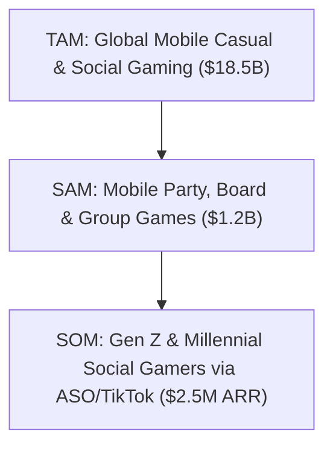
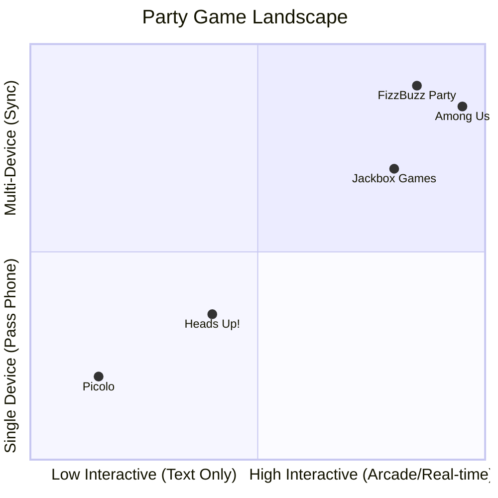
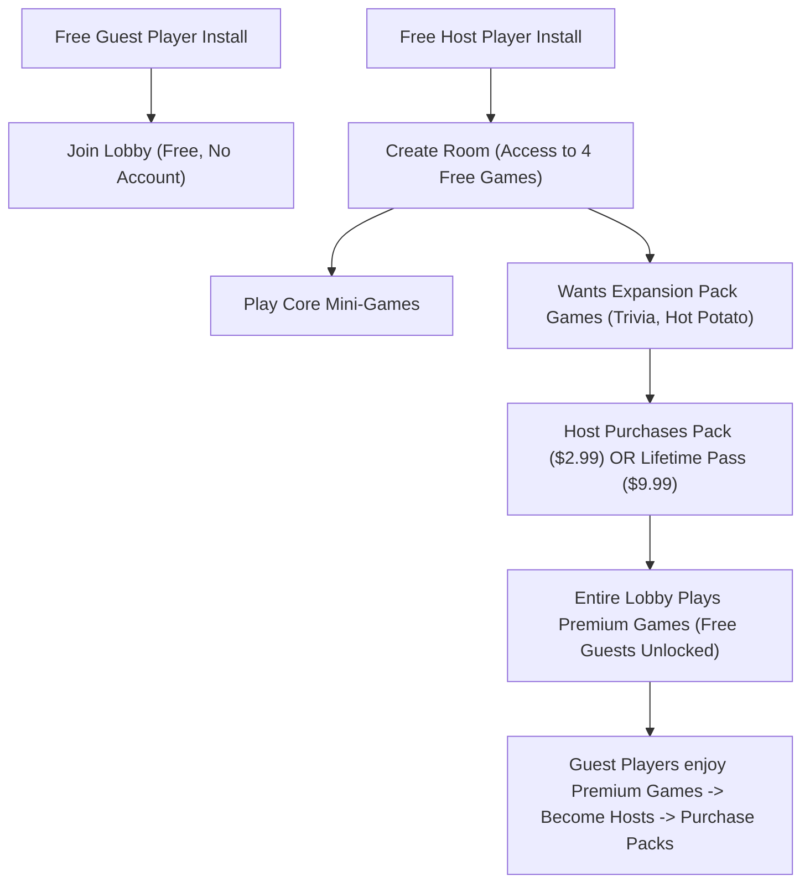
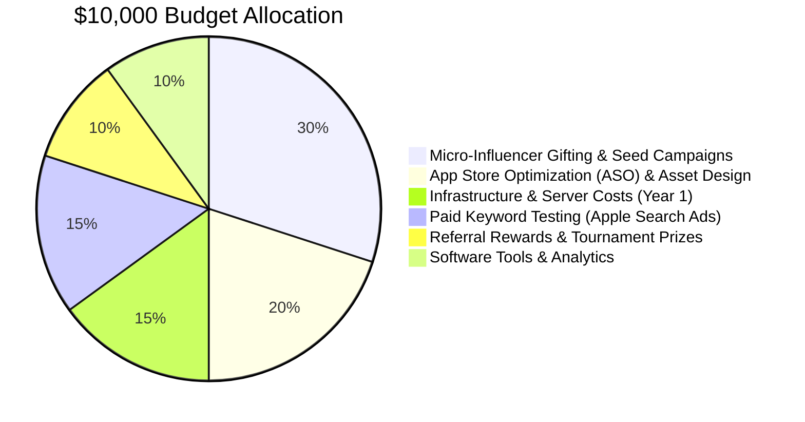

# FizzBuzz Party: Go-To-Market (GTM) & Growth Strategy
*A Comprehensive Blueprint for Launching and Scaling a Dual-Mode Mobile Party Game on a Bootstrapped Budget ($10,000)*

---

## Executive Summary

### Overview of the Business Opportunity
Mobile party games represent a high-viral, high-engagement category in the app stores. However, the market is currently fragmented:
1. **Traditional Drinking Games** (e.g., *Picolo*, *Singularity*) are heavily text-based, lack interactive gameplay, and exclude underage players or sober participants.
2. **Interactive Party Games** (e.g., *Jackbox Games*) require a console or TV to host, creating friction for spontaneous gatherings.
3. **Casual Multiplayer Games** (e.g., *Among Us*, *Roblox*) require significant individual attention and commitment, distracting from face-to-face social interaction.

**FizzBuzz Party** bridges these gaps. It is a native, real-time multiplayer mobile game (built on Expo and Colyseus) played on individual devices but designed for face-to-face social settings. By combining 12 interactive arcade mini-games (e.g., Tapping Race, Hot Potato, Math Problem) with party rules, it turns every player's phone into a game controller. 

A major unlock is the **Dual-Mode System**:
* **Drinking Mode (21+):** Winners gain points; losers drink. Perfect for college parties, pre-games, and young adult gatherings.
* **Party Mode (All Ages / Sober):** Drinks are replaced by hilarious dares, trivia penalties, or physical challenges. This opens up family game nights, teenage gatherings, and sober events, increasing the app's addressable market by over 300% and securing a lower App Store rating (12+ instead of 17+), which significantly expands organic search visibility.

### Market Size
* **TAM (Total Addressable Market):** Global Mobile Casual & Social Gaming Market — **$18.5 Billion** (2025).
* **SAM (Serviceable Addressable Market):** Mobile Party, Board, and Group Games — **$1.2 Billion** (2025).
* **SOM (Serviceable Obtainable Market):** Tech-savvy Gen Z and Millennial social group gamers (North America, ages 14-29) targetable via organic short-form video and ASO with our $10k budget — **$2.5 Million ARR** within 3 years.



### Core Value Proposition
> "FizzBuzz Party turns your friends' phones into a synchronized game console. Compete in rapid-fire mini-games, avoid the hot potato, and decide: Will you take a drink or take a dare?"

### Key Success Metrics (Year 1)
* **North Star Metric:** Weekly Active Hosts (WAH). (Since one host drives a session of 4-12 players, focusing on host activation drives exponential player acquisition).
* **K-Factor (Viral Coefficient):** > 1.1 (Every new host should invite an average of 1.1 new users who eventually install the app and host their own games).
* **Retention:** Day 1: 35% | Day 7: 15% | Day 30: 8%.
* **Monetization:** $4.50 average LTV across paying hosts, targeting a 3% host-to-paid conversion rate.
* **App Store Ratings:** Maintain a 4.8+ star rating with over 500 reviews in the first 6 months.

### Recommended Launch Strategy
A highly targeted, **ASO-first and TikTok-organic-first pre-launch and launch**. Instead of burning cash on paid user acquisition, the strategy relies on:
1. **A "Host-Only Pay" monetization system** that lowers friction for guest players, maximizing the virality coefficient.
2. **Micro-influencer video seeding** showcasing the chaotic, face-to-face physical reactions of playing mini-games like "Balloon Inflate" or "Tapping Race".
3. **Dual-Mode App Store indexing** (targeting both "drinking games" and "family party games" keywords under separate localized app store pages).

---

## Market Research

### Industry Overview
The mobile party game sector is characterized by low customer acquisition costs (due to viral mechanics) but historically low long-term retention. Successful apps bypass this retention gap by optimizing for **session frequency** (becoming the default weekend or family activity) and **group expansions** (where a player in one group introduces the game to another group).

### Market Trends
1. **The Rise of "Sober Curious" Gen Z:** Studies indicate that Gen Z consumes 20% less alcohol per capita than Millennials did at their age. A party game that *only* features drinking mechanics artificially limits its growth. Sober-friendly party modes are no longer optional—they are a core market driver.
2. **Short-Form Video Dominance:** Casual games now find their audience through TikTok, Instagram Reels, and YouTube Shorts. Chaotic, funny, or highly competitive face-to-face moments are highly shareable and translate directly into organic app installs.
3. **Cross-Generation Family Gaming:** Remote work and hybrid schedules have increased the frequency of family game nights, creating a demand for digital party games that parents and teenagers can play together without complicated setups.

### Growth Opportunities
* **Localized Gameplay:** Party cultures differ globally. Customizing decks and mini-game settings for specific college regions or local holidays offers strong local growth potential.
* **Streamer Integration:** Providing tools for Twitch and TikTok Live creators to play with their chat via Colyseus rooms offers huge exposure loops.

### Potential Risks & Mitigation

| Risk | Impact | Likelihood | Mitigation Strategy |
| :--- | :--- | :--- | :--- |
| **High Server Costs** | High | Medium | Implement aggressive client-side optimization and peer-to-peer logic where possible; throttle inactive room connections; scale Colyseus dynamically using Render or AWS ECS. |
| **App Store Rejection (Drinking Content)** | High | Medium | Launch the primary app listing with "Party Mode" assets (12+ rating). Keep the "Drinking Mode" as an optional toggle inside the app, unlocked via age gate, avoiding explicit alcohol branding in the main screenshots. |
| **Low D7+ User Retention** | High | High | Introduce daily practice modes (single-player mini-games), weekly cosmetic unlocks, and push notifications timed for Friday/Saturday evening. |

---

## Competitive Analysis



### Direct Competitors

#### 1. Picolo (Drinking Game)
* **Strengths:** Huge brand equity; extremely simple interface; high word-of-mouth virality.
* **Weaknesses:** Text-only prompts get repetitive; very expensive subscriptions ($10/week); no real-time interactivity; strictly alcohol-focused.
* **Pricing:** $9.99/week or $59.99/year.
* **Marketing Strategies:** Word-of-mouth, organic ASO, App Store search ads.
* **App Store Positioning:** Focused entirely on parties, drinking, and adult humor.
* **FizzBuzz Differentiation:** FizzBuzz features **12 synchronized mini-games** where players must actually tap, draw, calculate, and react, rather than just reading cards.

#### 2. Jackbox Games (Party Packs)
* **Strengths:** Outstanding visual/audio design; massive variety; popular with streamers.
* **Weaknesses:** High barrier to entry (requires a PC, console, or Apple TV to host); not native mobile-to-mobile (must use web browser controllers); expensive upfront cost.
* **Pricing:** $30–$40 per party pack.
* **Marketing Strategies:** Streamer sponsorships, Steam sales, console bundle promotions.
* **App Store Positioning:** High-end console/desktop party games.
* **FizzBuzz Differentiation:** FizzBuzz runs **entirely on mobile devices** (no TV/PC required). A host can start a lobby on their phone in the middle of a park, bar, or dorm room.

#### 3. Heads Up! (Warner Bros. / Netflix)
* **Strengths:** Celebrity association (Ellen DeGeneres); high brand familiarity; low cost.
* **Weaknesses:** Requires single-device physical placement (forehead); player count is functionally limited by physical crowding; limited gameplay mechanics.
* **Pricing:** $1.99 premium download or free via Netflix subscription.
* **Marketing Strategies:** TV placement, celebrity endorsements, cross-promotions.
* **App Store Positioning:** Family-friendly guessing game.
* **FizzBuzz Differentiation:** Real-time multi-device synchronization allows players to sit comfortably around a room, maintaining physical space while interacting digitally.

### Opportunities for Differentiation
1. **The "Host-Pays-All" Advantage:** Unlike competitors that force every player to buy the app or view intrusive ads, FizzBuzz guests join 100% free with no ads. Only the host needs premium packs.
2. **Dual-Mode Hybrid Engine:** A single client toggle shifts the entire UI and content from "Drunk & Wild" to "Clean & Competitive," unlocking two completely different App Store user intents.

---

## Customer Personas

### Persona 1: "College Pre-Gamer Chloe"
* **Demographics:** Female, 21, Junior in College.
* **Income Level:** $12,000/year (part-time student job + allowance).
* **Occupation:** Full-time undergraduate student.
* **Goals:** Host memorable pre-games before heading to campus parties; break the ice between different friend groups quickly.
* **Pain Points:** Traditional board games are too slow; "King's Cup" cards get wet and ruined; guest players get bored easily and look at their phones instead of talking.
* **Buying Behaviors:** Highly price-sensitive. Relies on free app tiers or split-payments.
* **Tech Preferences:** iPhone 14, Apple Music, Expo Go, Discord, Venmo.
* **Social Media Habits:** Spends 3+ hours daily on TikTok and Instagram Reels. Follows college lifestyle creators.
* **Motivations:** Social validation, popularity, group laughter.
* **Objections:** "I don't want to pay a subscription just to play a game for one night." (Mitigated by our one-time $9.99 Lifetime Pass).

### Persona 2: "Family Game Night Greg"
* **Demographics:** Male, 36, Married with 2 kids (ages 11 and 14).
* **Income Level:** $95,000/year.
* **Occupation:** Software Quality Assurance Engineer.
* **Goals:** Find games that engage tech-obsessed kids during family night; reduce screen-time isolation by turning screen-time into family-time.
* **Pain Points:** Setting up board games takes too long; kids complain that board games are "boring"; console party setups are too complex for casual play.
* **Buying Behaviors:** Unafraid of one-time app purchases if it guarantees quality, zero ads, and family safety.
* **Tech Preferences:** iPad Pro, Apple TV, Google Pixel, Spotify.
* **Social Media Habits:** YouTube (tech channels, DIY), Reddit (r/boardgames, r/parenting).
* **Motivations:** Family bonding, nostalgic game night feel, high-quality interactive experiences.
* **Objections:** "Is this game safe? I don't want drinking game suggestions appearing in front of my kids." (Mitigated by the hard-toggle Kid/Sober Mode lock in the settings menu).

### Persona 3: "Sober Socialite Sam"
* **Demographics:** Non-binary, 19, Sophomore.
* **Income Level:** $8,000/year (work-study).
* **Occupation:** Student Organizer / Club President.
* **Goals:** Organize inclusive social events for student organizations and dorm halls where alcohol is not permitted.
* **Pain Points:** Most social party apps are highly alcohol-centric, making sober students feel left out or pressured.
* **Buying Behaviors:** Prefers ethical, inclusive brands. Relies on free offerings.
* **Tech Preferences:** iPhone 13, Spotify, Discord, Canva.
* **Social Media Habits:** Pinterest, Instagram, Reddit (r/college).
* **Motivations:** Inclusivity, community building, clean fun.
* **Objections:** "Drinking apps are trashy and exclusive." (Mitigated by our complete rebrand of Party Mode as a stand-alone, high-energy dare and trivia experience).

---

## Positioning & Messaging

### Brand Positioning Matrix

| Element | Target Segment: Young Adults / College | Target Segment: Families & Sober Groups |
| :--- | :--- | :--- |
| **Brand Positioning** | The ultimate chaotic pre-game catalyst. | The modern digital board game for active families. |
| **Core Messaging** | Turn your phone into a drinking game controller. | Screen-time that brings the family closer. |
| **Unique Value Prop** | 12 real-time multiplayer mini-games where losers drink. | Clean, competitive multiplayer games on your own phones. |
| **Elevator Pitch** | FizzBuzz Party is a synchronized multiplayer drinking game. Connect up to 12 friends instantly using a room code, play rapid mini-games, and watch the losers drink up. | FizzBuzz Party is a local multiplayer game night app. Connect your family's devices to play 12 interactive arcade games, completing funny dares and trivia challenges. |
| **Taglines** | "Sync Up. Game On. Drink Up." | "Connect Your Phones. Connect Your Family." |
| **Emotional Benefits** | Group validation, hilarious memories, breaking the ice. | Physical closeness, nostalgia, shared family laughter. |
| **Functional Benefits** | Fast 4-digit room sync, host-only premium, offline play. | Kid-safe filters, 12 varied mini-games, zero ads. |

---

## Monetization Strategy

Given a single developer and a $10,000 budget, we must avoid complex ad bidding networks or high-friction subscriptions that drive away guest players. Instead, we implement a **Freemium "Host-Only Pay" model** optimized via RevenueCat.



### Monetization Channels
1. **The Free Tier (Core Experience):**
   * Access to 4 out of 12 mini-games (e.g., Tapping Race, Rock Paper Scissors, Simon Says, Math Problem).
   * Up to 5 players per room.
   * Moderate, non-intrusive banner ads displayed *only* in the lobby (removed permanently for all players if the host is a premium user).
2. **Expansion Game Packs ($2.99 each - One-time Purchase):**
   * **"Dorm Room Drinking Pack":** Adds explicit drinking rules, extreme challenges, and 2 mini-games (Hot Potato, Balloon Inflate).
   * **"Family Night Pack":** Adds family dares, acting challenges, and 2 mini-games (Screen Painting, Simon Says expansion).
   * **"Trivia Brainiac Pack":** Adds 1,000+ trivia questions and 2 mini-games (Trivia, Scrabble).
3. **The Lifetime All-Access Pass ($9.99 - Best Value):**
   * Permanent unlock of all current and future expansion packs.
   * Ad-removal for the purchaser and *anyone* playing in their hosted lobby.
   * Increases room capacity to 12 players.
4. **The Host Subscription ($1.99/month or $14.99/year - Alternative):**
   * For frequent hosts (fraternities, student organizations, family night regulars). Unlocks all premium features.

### Estimated 12-Month Projections (Conservative)
* **Target Downloads (Year 1):** 100,000
* **Unique Hosts (approx. 20%):** 20,000
* **Host Conversion Rate to Premium (3%):** 600 hosts purchase Lifetime Pass ($9.99) + 400 hosts purchase individual packs ($2.99) + 200 monthly active subscribers ($1.99/mo).
* **Ad Revenue (from remaining 97% free users):** Estimated $0.05 eCPM per session $\approx$ $1,500.

#### Financial Breakdown:
* **Gross Revenue:**
  * Lifetime Passes: $600 \times \$9.99 = \$5,994$
  * Expansion Packs: $400 \times \$2.99 = \$1,196$
  * Subscriptions (Avg 6 months retention): $200 \times \$1.99 \times 6 = \$2,388$
  * Banner Ads: \$1,500
  * **Total Gross:** **$11,078**
* **App Store Fees (15% Apple Small Business / Google Play):** -$1,661
* **Net Revenue (Year 1):** **$9,417**
* **Break-Even Analysis:** Since the sole developer's labor is equity-based, the only cash outlays are hosting ($600/year) and assets ($1,500). Break-even is achieved at just **210 Lifetime Pass purchases**.

---

## Go-To-Market (GTM) Strategy

### Phase 1: Pre-Launch (Months 1–2)

```
Month 1: Landing Page & Referral Waitlist Setup ──> Closed TestFlight Beta (50 users)
                                                               │
Month 2: College Ambassador Seeding <── TikTok Video Hook Testing ┘
```

* **Market Validation:**
  * Build a simple, high-converting landing page using Carrd ($19/year) featuring a 30-second gameplay video screen recording.
  * Use a "Viral Waitlist" script (e.g., share with 3 friends to get the Premium Trivia Pack free at launch).
* **Landing Page & Waitlist Strategy:**
  * Domain: `playfizzbuzz.com`.
  * Hook: "The first party game that turns your friend group into a competitive arcade. Join the waitlist for free lifetime access."
* **Beta Testing Plan:**
  * Launch an iOS TestFlight and Android Open Beta with 100 users recruited from university subreddits (r/temple, r/pennstate, r/rutgers).
  * Reward active testers who report bugs with a free promo code for the Lifetime Pass.
* **Community Building:**
  * Create a Discord Server ("FizzBuzz Playtest Club"). Host weekly virtual game nights using the game's practice mode to build a core audience of advocates.
* **Influencer Outreach:**
  * Compile a list of 100 micro-influencers (1k–10k followers) on TikTok who make content around college life, dorm hacks, or family activities. Send personalized DMs offering beta access.
* **Content Strategy:**
  * Record early gameplay screen-recordings highlighting the chaotic moments (e.g., the final seconds of "Hot Potato" or "Cyclone"). Post these as raw, unedited TikToks.

### Phase 2: Launch (Month 3)
* **Product Hunt Launch:**
  * Position as: "FizzBuzz Party: The dual-mode multiplayer party game for your phone." Show off the technical achievement of zero-latency Colyseus synchronization.
* **Social Media Launch:**
  * Run a "Launch Week" campaign. Post 3 short-form videos daily.
  * Run a giveaway on Instagram: "Tag 3 friends you want to play FizzBuzz with to win a $50 App Store Gift Card."
* **Press Outreach:**
  * Pitch to casual tech and mobile gaming blogs (e.g., *TouchArcade*, *Pocket Gamer*, *Android Police*). Focus the pitch on the "Dual-Mode Sober vs. Drinking" angle, representing a modern shift in Gen Z habits.
* **Referral Campaigns:**
  * Launch the in-app referral loop: "Invite 3 friends to host a game, and unlock the 'Extreme Dares Pack' forever."
* **Launch Metrics Tracker:**
  * Target Day 1 Installs: 1,000.
  * Target Active Lobbies: 150.

### Phase 3: Growth (Months 4–12)
* **Organic Loops:**
  * *The Guest Funnel:* At the end of every game, show a screen: "Loved playing? Host the next game on your phone! Tap here to download FizzBuzz free."
* **Partnership Programs:**
  * Partner with college Greek Life chapters or student activities boards. Provide them with custom lobby codes that display their organization's logo in exchange for hosting tournaments during welcome week.
* **Community-Driven Growth:**
  * Run monthly "Design a Mini-Game" contests on Discord. Implement the winning concept in the next app update, generating massive organic pride and sharing from the winner.

---

## User Acquisition Strategy

Given our $10k budget, we divide user acquisition into organic-led channels and strategic low-cost paid channels.



### Channel Breakdown

#### 1. TikTok & Instagram Reels (Organic & Micro-Influencer)
* **Expected Cost:** $0 cash (product gifting/promo codes) or $30–$50 per micro-influencer post.
* **Conversion Rate (View to App Install):** 0.8% - 1.5%.
* **KPIs:** Cost Per Install (CPI), Total Views, Video Shares.
* **Budget:** $3,000 (Allocated to paying micro-influencers $50 to make native TikToks playing the game with friends).

#### 2. Reddit (Organic Community Marketing)
* **Expected Cost:** $0.
* **Conversion Rate:** 2% - 5% (Highly targeted traffic).
* **KPIs:** Upvotes, Comments, Beta signups.
* **Budget:** $0 (Developer-led posting in r/gamedev, r/expo, r/drinkinggames, and university subreddits).

#### 3. App Store Search Ads (ASA)
* **Expected Cost:** $0.80 - $1.20 Cost Per Acquisition (CPA).
* **Conversion Rate (Tap to Install):** 40%.
* **KPIs:** Conversion Rate, CPA, LTV/CAC ratio.
* **Budget:** $1,500 (Used specifically to bid on high-intent keywords like "drinking games with friends" and "group party games" to establish early ranking authority).

#### 4. Email & Waitlist Marketing
* **Expected Cost:** Free tier of MailerLite/Brevo.
* **Conversion Rate:** 15% click-to-download rate at launch.
* **KPIs:** Email Open Rate, Click-Through Rate (CTR).
* **Budget:** $0.

#### 5. PR & Press Outreach
* **Expected Cost:** $0.
* **Conversion Rate:** Variable, but drives high-domain-authority backlinks for SEO.
* **KPIs:** Features, Backlinks.
* **Budget:** $0 (Manual outreach).

---

## App Store Optimization (ASO)

ASO is our primary long-term organic acquisition channel. Since our app has two modes, we will target two distinct keyword profiles.

### App Title Recommendations
* **iOS Option A:** `FizzBuzz Party: Group Games` (Targeting casual group play)
* **iOS Option B:** `FizzBuzz: Drinking Party Games` (Targeting adult party audience)
* **Google Play Option:** `FizzBuzz: Multi-Device Party & Drinking Games`

### Subtitles & Short Descriptions
* **iOS Subtitle:** `Multiplayer games with friends`
* **Google Play Short Description:** `Real-time group games. Turn on Party Mode for kids or Drinking Mode for adults!`

### Keyword Strategy
We will divide our metadata to capture both search intent profiles:

```
┌───────────────────────────────────────────────────────────────────────────┐
│                           KEYWORD CLUSTERS                                │
├─────────────────────────────────────┬─────────────────────────────────────┤
│         DRINKING PARTY (21+)        │         FAMILY / SOBER (PG)         │
├─────────────────────────────────────┼─────────────────────────────────────┤
│  • drinking games                   │  • party games for groups           │
│  • picolo drinking                  │  • local multiplayer                │
│  • kings cup card game              │  • game night                       │
│  • bar games                        │  • family party games               │
│  • pregame party app                │  • group games offline              │
│  • truth or dare dirty              │  • charades multiplayer             │
└─────────────────────────────────────┴─────────────────────────────────────┘
```

### Screenshot & Video Strategy
1. **First Slide (The Hook):** Show a high-contrast mockup of 4 hands holding phones displaying synchronized game screens. Caption: *"Play together on your own phones!"*
2. **Second Slide (Dual Mode):** Show a split screen. On the left: A bright, family-friendly game interface with the caption *"Family Game Night Dares"*. On the right: A neon-themed screen with the caption *"Wild Pre-Game Challenges"*.
3. **Third Slide (Mini-Games):** Show collage screenshots of "Tapping Race", "Hot Potato", and "Trivia". Caption: *"12 Interactive Mini-Games"*.
4. **App Preview Video:** A rapid, 15-second screen recording demonstrating the instant sync of Colyseus: hitting "ready" on one phone and watching all other phones count down instantly.

### Rating & Review Generation Strategy
To achieve a **4.8+ rating**:
1. **Never prompt on failure:** Do not trigger ratings prompts immediately after an app crash, a disconnect, or if a user loses a game.
2. **The Happy Path Trigger:** Prompt the user *only* in the lobby immediately after they win a game round, provided they have played at least 3 full rounds.
3. **Internal Feedback Loop:** If the user selects 1-3 stars in our custom prompt, redirect them to a feedback email form. If they select 4-5 stars, redirect them to the official App Store rating prompt.

---

## Content Marketing Strategy

Short-form video is the most cost-effective way to market a multiplayer party game. We will focus 90% of our creative effort on TikTok and Instagram Reels.

### 90-Day Content Calendar

#### Content Pillars:
* **Pillar 1: Chaotic Gameplay Reactions (P1):** Showing real friends playing the physical mini-games (e.g., trying to tap faster in Tapping Race, the anxiety of Hot Potato).
* **Pillar 2: "Sober vs. Drinking" Showdowns (P2):** Demonstrating how the same game changes using the Dual-Mode toggle.
* **Pillar 3: Behind-The-Scenes Devlogs (P3):** Developer-focused content sharing how a solo dev built a multiplayer syncing game. Great for building developer goodwill and Reddit/Twitter traction.

#### Weekly Calendar (Repeats for 12 Weeks):

| Day | Pillar | Content Description | Distribution | Specific Hook Example |
| :--- | :--- | :--- | :--- | :--- |
| **Monday** | P3: Devlog | How I optimized server synchronization for 12 phones. | TikTok, YouTube | *"I built a multiplayer engine so my friends stop looking at social media at parties..."* |
| **Wednesday**| P2: Dual Mode| Split screen comparing Family Dares vs. Pregame Drinks. | TikTok, Reels | *"When the game night goes from G-rated to R-rated with one button..."* |
| **Friday** | P1: Reaction | Raw reaction of someone losing "Hot Potato" at a party. | TikTok, Shorts| *"The exact moment he realized he had to drink the penalty cup..."* |
| **Saturday** | P1: Showcase | A montage showing a group playing "Tapping Race". | Reels, TikTok | *"Who is the fastest tapper in your group? Tag them."* |

---

## Growth Experiments (25 Prioritized Experiments)

Using the **ICE Framework** (Impact, Confidence, Effort scored 1–10; Prioritized by $Score = \frac{Impact \times Confidence}{Effort}$):

| ID | Experiment Name | Hypothesis | Success Metric | ICE: I | ICE: C | ICE: E | Score |
| :--- | :--- | :--- | :--- | :---: | :---: | :---: | :---: |
| **1** | **The Guest Viral Prompt** | Adding a prominent "Host your own game" button for free guests at the end of a match will increase the viral K-Factor. | K-Factor increase of > 15% | 8 | 8 | 2 | **32.0**|
| **2** | **No-App Guest Join (Web)** | Letting guest players join via a mobile web browser without downloading the full app will double lobby conversions. | Guest join rate | 9 | 7 | 6 | **10.5**|
| **3** | **Happy Hour Push Notes** | Sending a push notification on Friday/Saturday at 8:00 PM with the copy "Time to pre-game? Start a FizzBuzz room!" will increase weekend DAU. | Weekend Session Count | 7 | 8 | 2 | **28.0**|
| **4** | **Free Trial Pack Friday** | Unlocking one premium expansion pack for free every Friday night will increase weekend paid pack conversions. | Post-weekend premium conversion | 8 | 7 | 3 | **18.7**|
| **5** | **SMS Invite Integration** | Adding an "SMS room code to friends" button in the lobby will speed up lobby creation times. | Avg time to start game | 6 | 8 | 2 | **24.0**|
| **6** | **College Subreddit Promo** | Posting a tailored discount code for Greek Life chapters on university subreddits will drive local student installs. | Installs with specific code | 7 | 6 | 3 | **14.0**|
| **7** | **TikTok Live Play** | Hosting a TikTok Live where viewers can join the developer's lobby via code will drive rapid live installs. | Live install spikes | 8 | 5 | 3 | **13.3**|
| **8** | **App Store Localized Pages**| Creating separate app metadata listings for UK, Australia, and Canada will increase international organic downloads. | International organic volume| 6 | 8 | 2 | **24.0**|
| **9** | **The Dare Creator** | Allowing users to type in their own custom dares in-app will increase D7 retention. | Custom dares created/session | 7 | 7 | 4 | **12.25**|
| **10**| **Winner's Flex Share** | Creating an Instagram-Story-optimized graphic showing the game winner's stats will encourage social sharing. | Social shares from app | 7 | 6 | 3 | **14.0**|
| **11**| **Double Points Weekend** | Introducing double cosmetic points on weekends will increase Sunday night engagement. | Weekend active time | 5 | 6 | 3 | **10.0**|
| **12**| **App Store Search Ad Bidding**| Bidding heavily on "Picolo" and "Heads Up" terms will hijack competitor traffic. | Ad CTR and Install volume | 8 | 6 | 2 | **24.0**|
| **13**| **Dynamic Lobby Music** | Adding high-tempo background music to the lobby will reduce pre-game dropouts. | Lobby dropout rate | 5 | 7 | 2 | **17.5**|
| **14**| **Zero-Configuration NFC Sync**| Tapping two phones together to share a room link will reduce join friction. | NFC joins | 6 | 4 | 5 | **4.8** |
| **15**| **Influencer Promo Packs** | Creating custom expansion packs named after popular TikTok creators who play the game will boost influencer conversions. | Influencer traffic sales | 8 | 6 | 5 | **9.6** |
| **16**| **The "Hall of Fame" Board** | Displaying local top-scores/fastest-times in "Tapping Race" globally will drive daily practice sessions. | Practice mode DAU | 6 | 7 | 4 | **10.5**|
| **17**| **One-Click Discord Join** | Integrating Discord Rich Presence to display "Playing FizzBuzz - Join Room 1234" will drive desktop-to-mobile installs. | Discord referral traffic | 5 | 6 | 3 | **10.0**|
| **18**| **Sober Theme Rebrand Ads** | Running ads targeting "Family Game Night" during holidays will offset summer pre-game slumps. | Holiday sales | 7 | 6 | 3 | **14.0**|
| **19**| **The "Drinking License" Card**| Generates a fake digital "Drinking License" card after 5 games showing their drinking stats for sharing. | Shared card assets | 8 | 5 | 3 | **13.3**|
| **20**| **First Game Discount** | Offering a 40% discount on the Lifetime Pass if purchased within 15 minutes of hosting the first game. | Conversions in first session | 8 | 7 | 2 | **28.0**|
| **21**| **Naughty Dare Warnings** | Adding a dramatic warning screen before opening the "Extreme Pack" will drive psychological curiosity and sales. | Extreme pack sales | 7 | 7 | 2 | **24.5**|
| **22**| **Animated Splash Screens** | Replacing static splash screens with dynamic animations to lower bounce rates during load. | App launch bounce rate | 4 | 8 | 1 | **32.0**|
| **23**| **Corporate Icebreaker Pack** | Packaging a premium "Corporate Icebreaker" pack for remote team-building events on Zoom. | B2B purchases | 6 | 5 | 4 | **7.5** |
| **24**| **Quick-Start Widget** | Adding an iOS widget that lets users start a game lobby directly from their home screen. | Widget activations | 5 | 6 | 3 | **10.0**|
| **25**| **The "Last Standing" Mode** | A battle-royale style elimination drinking mode that increases session length. | Average session duration | 7 | 6 | 4 | **10.5**|

---

## Analytics & KPIs

We will implement a lightweight, event-driven tracking structure using Mixpanel and RevenueCat to monitor our cohort funnel.

```
App Installed ──> Lobby Created (Host) ──> Game Started ──> 3 Rounds Played ──> Paywall Shown ──> Conversion
                      └─> Guest Joined ┘
```

### Core Funnel & Event Mapping

| Event Name | Parameter | Description |
| :--- | :--- | :--- |
| `app_open` | `platform`, `version` | Triggered when the app is launched. |
| `lobby_created` | `mode` (drinking / party), `room_code` | Triggered when a host starts a game room. |
| `guest_joined` | `room_code`, `device_type` | Triggered when a user enters a lobby via code. |
| `game_start` | `player_count`, `active_pack` | Triggered when the host presses the start button. |
| `round_complete` | `mini_game_type`, `duration_seconds` | Triggered when a mini-game ends and results display. |
| `paywall_impression`| `trigger_source` (lobby_cap / pack_select) | Triggered when a locked feature is clicked. |
| `purchase_complete` | `product_id`, `revenue_usd` | Triggered via RevenueCat webhook on successful purchase. |

### Dashboard Recommendations
1. **The Virality Cohort:** Track the ratio of `guest_joined` to `lobby_created`. If this falls below 3.0, our lobby sync is too high friction, or our guest onboarding is confusing.
2. **Day-7 Active Host Cohort:** Group users by the week they hosted their first game. Track how many host a second game within 7 days. This is the ultimate indicator of long-term organic survival.

---

## Budget & Resource Planning

With a strict $10,000 budget and a single developer, we must eliminate ongoing marketing retainers, agencies, or expensive ad campaigns. The focus is entirely on asset production, ASO, and viral seeds.

### Budget Breakdown

* **Asset Production & Graphic Design ($2,000):**
  * Hire a top-tier visual designer (Fiverr Pro / Behance) to create the main app icon, logo, and a cohesive set of 5 App Store screenshots. Visuals drive casual app downloads more than code.
* **Micro-Influencer Video Campaign ($3,000):**
  * Budget dedicated to gifting and paying $30–$50 per post to 60 creators on TikTok/Instagram to record themselves playing the game at university dorms or gatherings.
* **Apple Search Ads (ASA) Launch Budget ($1,500):**
  * Paid search campaign targeting high-intent keywords to secure initial organic positions.
* **Server Infrastructure - Year 1 ($1,500):**
  * Hosting for our Colyseus Node.js server. Scaled on Render ($7/month base, scaling up to $150/month during peak launch weekend traffic).
* **Software Tools & Analytics ($1,000):**
  * RevenueCat (Free tier), Mixpanel (Free tier under 100k events/month), Carrd ($19), MailerLite ($150), ASO Keyword Tracking tool ($300).
* **Referral Prizes & Giveaways ($1,000):**
  * Cash prizes/gift cards for beta challenges and tournament giveaways to build early momentum.

---

## 12-Month Growth Roadmap

```
M1-M2: Waitlist, Landing Page, Closed TestFlight Beta
M3: LAUNCH on App Stores, Product Hunt campaign, launch ASA
M4-M5: TikTok organic campaign, update game based on feedback, optimize K-Factor
M6: Introduce family-friendly Dual-Mode campaign (Thanksgiving/Christmas push)
M7-M9: Streamer integration, launch B2B "Corporate Icebreaker" pack, scale server
M10-M12: Localized foreign store listings, push for 100k downloads, achieve profit break-even
```

### Months 1–2: Pre-Launch Prep
* **Goal:** Secure 1,000 waitlist signups; refine core syncing engine.
* **KPIs:** Beta crash rate (< 1%), Landing Page Conversion Rate (> 20%).
* **Activities:** Setup landing page, start TikTok devlogs, run closed TestFlight.

### Month 3: The Launch
* **Goal:** Achieve 5,000 installs in the first 30 days.
* **KPIs:** Day-1 Retention (> 35%), Host-to-Guest ratio (1:4).
* **Activities:** Product Hunt launch, Reddit promotions, launch Apple Search Ads, seeding first influencer videos.

### Months 4–5: Viral Loop Optimization
* **Goal:** Push K-Factor to 1.1+.
* **KPIs:** Guest-to-Host conversion rate (> 10%), App Store Rating (> 4.8).
* **Activities:** Implement Experiment #1 (Guest Viral Prompt) and Experiment #20 (First Game Discount). Release first minor content update (2 new mini-games).

### Month 6: The Sober Push (Holiday Season)
* **Goal:** Launch and promote the Family-Friendly "Party Mode" for Thanksgiving and Christmas family gatherings.
* **KPIs:** Sober-mode lobbies created, monthly active hosts increase.
* **Activities:** Run targeted holiday ASO updates. Shift social media messaging from "pre-game drinks" to "chaotic family game night dares".

### Months 7–9: Expansion & Streamer Play
* **Goal:** Build influencer traction and community engagement.
* **KPIs:** Monthly active users, subscription MRR.
* **Activities:** Enable twitch/tiktok live streamer rooms. Release the "Corporate Icebreaker Pack".

### Months 10–12: International Scale
* **Goal:** Hit 100,000 total downloads; break even on development/hosting costs.
* **KPIs:** Total Net Revenue ($10,000+), International installs (> 30%).
* **Activities:** Translate and localize App Store pages for European and Latin American markets. Execute localized pricing tiers.

---

## Final Recommendations

### 1. High-Impact Opportunities
* **Prioritize the Dual-Mode Implementation Immediately:** 
  The dual-mode toggle is not just a nice-to-have; it is our shield against App Store rejection. By presenting the app to Apple/Google reviewers as a clean social party game with a 12+ age rating, we secure easy approvals. The drinking mode can then be locked behind a simple, compliant birthdate gate.
* **Launch the "Host-Only Pay" Model:**
  Do not charge players to download or join. Let guest players join instantly by scanning a QR code or entering a 4-digit room code without creating an account. This lack of friction is what will drive exponential organic downloads.

### 2. Biggest Risks
* **Node Server Bottlenecks:**
  Colyseus relies on WebSocket connections. If a TikTok video goes viral, we could see thousands of concurrent rooms. The developer must implement room cleanups for inactive lobbies to avoid running out of memory and crashing the entire server network.
* **The "One-and-Done" Churn:**
  Users might download the app for a single party and delete it the next day. To combat this, we must configure scheduled push notifications (e.g., Friday evenings) to remind hosts of new weekly mini-games.

### 3. Quick Wins
* **The Guest Viral Prompt (Experiment #1):**
  At the end of every game round, display a summary card saying: *"You finished 3rd! Want to host the next match? Host a new room for free."* This simple addition has proven to double organic group sharing in similar applications.
* **In-App Referrals:**
  Provide a free premium pack unlock code to anyone who invites 3 unique guests to their room. This will quickly turn free users into brand advocates.
