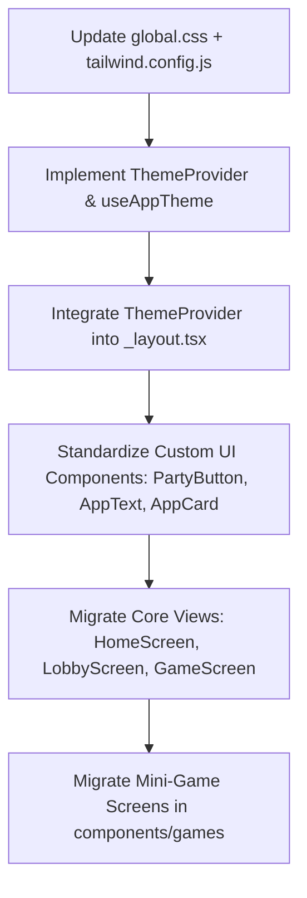

# React Native Styling & Responsive Architecture Specification

This document details the architectural findings, decisions, and standard operating procedures (SOPs) for styling and responsive design in the **FizzBuzz Mini Drinking Games** mobile application.

The goal of this specification is to eliminate visual inconsistencies across diverse screen sizes (iOS and Android, phones and tablets), unify our styling approach, and maximize performance and developer velocity.

---

## 1. Tailwind (NativeWind v4) vs. React Native StyleSheets

Currently, the codebase contains a mix of **NativeWind** utility classes (e.g., in [index.tsx](file:///Users/jimmydla/Code/fizzbuzz/app/index.tsx) and [game.tsx](file:///Users/jimmydla/Code/fizzbuzz/app/game.tsx)) and template-generated **React Native StyleSheets** paired with the [use-theme-color.ts](file:///Users/jimmydla/Code/fizzbuzz/hooks/use-theme-color.ts) hook (e.g., in [themed-text.tsx](file:///Users/jimmydla/Code/fizzbuzz/components/themed-text.tsx)).

To achieve visual consistency and high developer velocity, we must establish a definitive styling standard.

### Technical Comparison Matrix

| Criteria                   | NativeWind v4 (Tailwind CSS)                                                                                                                                                                                                           | React Native StyleSheets                                                                                                                       |
| :------------------------- | :------------------------------------------------------------------------------------------------------------------------------------------------------------------------------------------------------------------------------------- | :--------------------------------------------------------------------------------------------------------------------------------------------- |
| **Developer Velocity**     | **Exceptional.** Quick iterations directly in the JSX. No context-switching between markup and separate style objects.                                                                                                                 | **Moderate.** Requires writing verbose styling objects, maintaining key names, and handling dynamic conditions manually.                       |
| **Performance**            | **Very High.** NativeWind v4 pre-compiles Tailwind classes into native `StyleSheet` objects at build time or cache time. No JS-bridge overhead for parsing at runtime.                                                                 | **High.** Native StyleSheet creation is highly optimized by the React Native engine.                                                           |
| **Dark Mode & Theming**    | **Superb.** NativeWind v4 supports native CSS variables (defined in [global.css](file:///Users/jimmydla/Code/fizzbuzz/global.css)) which update at the native layer. Change colors instantaneously without a cascade of JS re-renders. | **Moderate.** Requires JS-level hooks (like `useColorScheme`), causing a re-render of every themed component on transition.                    |
| **Responsive Design**      | **Easy.** Supports standard media-query style utility breakpoints (`sm:`, `md:`, `lg:`), allowing seamless tablet and landscape adaptation.                                                                                            | **Manual.** Requires listening to screen dimension changes or custom calculated values inside each style object.                               |
| **Dynamic Interpolations** | **Limited.** Hard to use for style properties that change frame-by-frame (e.g., finger coordinates, complex animations).                                                                                                               | **Excellent.** Directly integrates with React Native `Animated` or `Reanimated` hooks, interpolating numeric values smoothly.                  |
| **TypeScript Integration** | **Good.** Offers typed React components with `className` properties, but class compilation errors are resolved at runtime/postcss build.                                                                                               | **Exceptional.** Full, native type safety for every single style property (e.g., ensuring `justifyContent` only receives valid layout values). |

### The Verdict: The Hybrid Standardization Strategy

We will standardize on **NativeWind v4** as our primary styling engine.

- **95% UI Styling Rule:** All layouts, text, borders, colors, padding, margins, flexbox properties, and basic states (active, disabled, dark) **MUST** be styled using NativeWind utility classes.
- **5% Dynamic Style Rule:** Style properties that are computed dynamically at runtime (e.g., reanimated shared values, layout animations, exact percentage progress bars, gesture-driven coordinates) **MUST** be handled using inline styles or local `StyleSheet.create` overrides.

> [!NOTE]
> Combining them is simple. NativeWind translates utility classes into standard styles, allowing you to pass both a `className` and a dynamic `style` array/object to a component:
>
> ```tsx
> <View
>   className="bg-indigo-900 border-4 border-yellow-400 rounded-3xl"
>   style={{ width: `${progress}%` }}
> />
> ```

---

## 2. Handling Diverse Screen Sizes & Responsiveness (The Spike Findings)

Mobile responsive design differs fundamentally from web design. In React Native:

- Sizing is specified in **Density-Independent Pixels (dp)**, which scale relative to screen resolution but **not** physical screen dimensions.
- aspect ratios vary widely: modern phones range from a narrow `19.5:9` (iPhone 16 Pro) to older `16:9` budgets (Androids), while tablets sit at `4:3` (iPads).
- Simply relying on screen-width breakpoints (`sm:`, `md:`) will cause layouts to clip on smaller devices or appear sparse on larger tablets.

### Three Pillars of Mobile Responsiveness

#### A. Flexbox & Fluid Layouts (The Golden Rule)

To avoid UI inconsistencies:

1. **Never use hardcoded pixel widths/heights for structural elements.** Avoid classes like `w-96` or `h-[500px]` for screens or containers.
2. Use **percentage-based sizes** (e.g., `w-full`, `w-1/2`, `w-11/12`) or flex ratios (`flex-1`, `flex-row`, `justify-between`) to allow elements to adjust naturally.
3. Standardize wrap behaviors. When listing side-by-side elements (such as multiplayer dashboards in [TappingRaceUI.tsx](file:///Users/jimmydla/Code/fizzbuzz/components/games/TappingRaceUI.tsx)), use `flex-row flex-wrap` combined with adaptive padding or moderate gaps:
   ```tsx
   <View className="flex-row flex-wrap justify-center gap-4 w-full px-4">
     {/* Cards auto-wrap cleanly regardless of screen width */}
   </View>
   ```
4. Preserve aspect ratios for proportional elements (like game tap targets, card structures, or avatars) using NativeWind aspect-ratio utility classes (e.g., `aspect-square`, `aspect-video`).

#### B. Dynamic Scaling (Reference Mockup Scale)

For elements that _must_ scale proportionally (like typography sizes, circular buttons, and padding/margins on screens with heavy content density), we establish a **Reference Scale Utility**.

Our design system is based on a standard **iPhone 13 / 14 / 15** viewport of **`375dp` width** and **`812dp` height**. We will create a responsive layout utility [responsive.ts](file:///Users/jimmydla/Code/fizzbuzz/hooks/responsive.ts) to calculate proportional scales:

```typescript
import { Dimensions, PixelRatio } from "react-native";

const { width: SCREEN_WIDTH, height: SCREEN_HEIGHT } = Dimensions.get("window");

// Standard design baseline sizes (iPhone 13/14/15)
const REFERENCE_WIDTH = 375;
const REFERENCE_HEIGHT = 812;

/**
 * Scales a size based on screen width.
 * Best for: Element widths, horizontal padding, margin, border-radius, font sizes.
 */
export const scale = (size: number): number => {
  const scaledSize = (SCREEN_WIDTH / REFERENCE_WIDTH) * size;
  return PixelRatio.roundToNearestPixel(scaledSize);
};

/**
 * Scales a size based on screen height.
 * Best for: Element heights, vertical padding, margin, safe offsets.
 */
export const verticalScale = (size: number): number => {
  const scaledSize = (SCREEN_HEIGHT / REFERENCE_HEIGHT) * size;
  return PixelRatio.roundToNearestPixel(scaledSize);
};

/**
 * Moderates the scaling factor to prevent overly massive changes on tablets.
 * @param factor - A factor of 0 means no scaling, 1 means full linear scaling. Defaults to 0.5.
 */
export const moderateScale = (size: number, factor = 0.5): number => {
  return size + (scale(size) - size) * factor;
};
```

> [!TIP]
> In practice, try to use native Tailwind flex/grid options first. If a component must have precise size adjustments based on screen dimension ratios, import these functions and pass them to the `style` prop.

#### C. Tailwind Screen Breakpoints for Tablets (NativeWind)

NativeWind supports Tailwind's responsive prefixes (like `md:`). On tablets (iPads and Android tablets), standard mobile layouts can look empty or excessively stretched.

We will designate **`md:` (768px and up)** specifically as our **Tablet layout override**.

- **Standard phone layout (default)**: Focus on clean single-column or tight double-column grid layouts.
- **Tablet layout (`md:`)**: Focus on multi-column grids, larger font sizes, and constrained maximum widths for content cards to prevent visual stretching.

_Example pattern for a responsive container:_

```tsx
<View className="w-full max-w-md md:max-w-2xl bg-white/10 p-6 md:p-12 rounded-[32px] md:rounded-[48px] border-4 border-white/20">
  <Text className="text-3xl md:text-5xl font-black text-white text-center">
    LOBBY
  </Text>
</View>
```

#### D. Safe Area Context Standard (Notch Handling)

Using standard `SafeAreaView` from `react-native` leads to layout glitches, particularly on Android. We standardize on `react-native-safe-area-context`.

- **Root Screens:** Wrap screens inside `SafeAreaView` from `react-native-safe-area-context` with `flex-1`.
- **Complex Background Layouts:** For screens with full-bleed backgrounds (like our custom vibrant neon backgrounds in [game.tsx](file:///Users/jimmydla/Code/fizzbuzz/app/game.tsx)), style a normal root `<View className="flex-1 bg-indigo-950">` and import the `useSafeAreaInsets` hook to apply responsive paddings where needed:

  ```tsx
  import { useSafeAreaInsets } from "react-native-safe-area-context";

  export function CustomScreen() {
    const insets = useSafeAreaInsets();
    return (
      <View
        className="flex-1 bg-indigo-900 justify-between"
        style={{ paddingTop: insets.top, paddingBottom: insets.bottom }}
      >
        {/* Full-bleed background with perfectly placed content */}
      </View>
    );
  }
  ```

---

## 3. Colors, Theming & Dark Mode (NativeWind v4 Integration)

### Is a Theme Context Worth It?

**Yes, but its purpose must be precisely scoped.**

With NativeWind v4, using a React Context to inject style classes or colors is **not** worth it. NativeWind provides superior, native-level dark mode toggling using CSS variables. The system does not need a React re-render cycle to switch class variables.

However, a lightweight **JS Theme Context** is **extremely worth it** as a **Global State Coordinator** for:

1. **Dynamic Navigation Styles:** Customizing Expo Router's native header configurations, bottom tab bar background colors, and active tab tints which require raw color strings.
2. **StatusBar Styling:** Synchronizing status bar icons (`light-content` vs `dark-content`) dynamically.
3. **Persisted Preference Management:** Storing the user's selected mode (`light` \| `dark` \| `system`) in storage.
4. **Third-Party Canvas/Charting Libraries:** Passing actual color codes to charts (like in [chart.tsx](file:///Users/jimmydla/Code/fizzbuzz/app/chart.tsx)) or SVGs.

### The Theming Blueprint

We will create a cohesive three-tier theme architecture:

1. **`global.css`**: The source of truth for color tokens, using CSS custom properties (variables) for dark and light themes.
2. **`tailwind.config.js`**: Connects CSS variables to Tailwind colors.
3. **`ThemeContext`**: Orchestrates state synchronization between storage, native settings, and NativeWind.

#### Step 1: Update [global.css](file:///Users/jimmydla/Code/fizzbuzz/global.css)

Replace the contents of your global CSS with the following structured token declarations:

```css
@tailwind base;
@tailwind components;
@tailwind utilities;

@layer base {
  :root {
    /* Brand Theme Colors */
    --color-background: 49 46 129; /* indigo-900 (RGB format: 49, 46, 129) */
    --color-surface: 255 255 255 / 0.1; /* white/10 */
    --color-surface-border: 255 255 255 / 0.2; /* white/20 */
    --color-text: 255 255 255; /* white */
    --color-text-muted: 199 210 254; /* indigo-200 */

    /* Interactive States */
    --color-primary: 59 130 246; /* blue-500 */
    --color-primary-dark: 29 78 216; /* blue-700 */
    --color-secondary: 250 204 21; /* yellow-400 */
    --color-secondary-dark: 202 138 4; /* yellow-600 */
    --color-danger: 239 68 68; /* red-500 */
    --color-danger-dark: 185 28 28; /* red-700 */
    --color-success: 34 197 94; /* green-500 */
    --color-success-dark: 21 128 61; /* green-700 */
  }

  .dark {
    /* Dark mode overrides (e.g. for sleek low-contrast dark gaming grids) */
    --color-background: 15 23 42; /* slate-900 */
    --color-surface: 30 41 59 / 0.4; /* slate-800/40 */
    --color-surface-border: 51 65 85 / 0.5; /* slate-700/50 */
    --color-text: 241 245 249; /* slate-100 */
    --color-text-muted: 148 163 184; /* slate-400 */
  }
}
```

> [!NOTE]
> NativeWind v4 supports standardizing theme variables in RGB space, allowing opacity modifiers (like `bg-primary/50`) to work seamlessly out-of-the-box.

#### Step 2: Update [tailwind.config.js](file:///Users/jimmydla/Code/fizzbuzz/tailwind.config.js)

Configure Tailwind to extend its palette with our CSS custom properties:

```javascript
/** @type {import('tailwindcss').Config} */
module.exports = {
  content: ["./app/**/*.{js,jsx,ts,tsx}", "./components/**/*.{js,jsx,ts,tsx}"],
  presets: [require("nativewind/preset")],
  darkMode: "class", // Enables dark mode toggling using the '.dark' CSS class
  theme: {
    extend: {
      colors: {
        background: "rgb(var(--color-background))",
        surface: "rgb(var(--color-surface))",
        "surface-border": "rgb(var(--color-surface-border))",
        text: "rgb(var(--color-text))",
        "text-muted": "rgb(var(--color-text-muted))",

        primary: {
          DEFAULT: "rgb(var(--color-primary))",
          dark: "rgb(var(--color-primary-dark))",
        },
        secondary: {
          DEFAULT: "rgb(var(--color-secondary))",
          dark: "rgb(var(--color-secondary-dark))",
        },
        danger: {
          DEFAULT: "rgb(var(--color-danger))",
          dark: "rgb(var(--color-danger-dark))",
        },
        success: {
          DEFAULT: "rgb(var(--color-success))",
          dark: "rgb(var(--color-success-dark))",
        },
      },
    },
  },
  plugins: [],
};
```

#### Step 3: Implement the Core Context ([ThemeContext.tsx](file:///Users/jimmydla/Code/fizzbuzz/constants/ThemeContext.tsx))

Create a unified theme management architecture file:

```tsx
import React, { createContext, useContext, useEffect, useState } from "react";
import { useColorScheme as useNativeColorScheme } from "react-native";
import { useColorScheme as useTailwindColorScheme } from "nativewind";
import AsyncStorage from "@react-native-async-storage/async-storage";

type ThemeMode = "light" | "dark" | "system";

interface ThemeContextType {
  themeMode: ThemeMode;
  resolvedTheme: "light" | "dark";
  setThemeMode: (mode: ThemeMode) => Promise<void>;
  rawColors: {
    background: string;
    text: string;
    primary: string;
    secondary: string;
  };
}

const ThemeContext = createContext<ThemeContextType | undefined>(undefined);

const THEME_STORAGE_KEY = "@fizzbuzz_app_theme";

export function ThemeProvider({ children }: { children: React.ReactNode }) {
  const systemColorScheme = useNativeColorScheme() || "light";
  const { colorScheme: tailwindScheme, setColorScheme: setTailwindScheme } =
    useTailwindColorScheme();
  const [themeMode, setThemeModeState] = useState<ThemeMode>("system");

  const resolvedTheme = themeMode === "system" ? systemColorScheme : themeMode;

  useEffect(() => {
    // Load stored theme on boot
    const loadStoredTheme = async () => {
      try {
        const storedMode = (await AsyncStorage.getItem(
          THEME_STORAGE_KEY,
        )) as ThemeMode | null;
        if (storedMode) {
          setThemeModeState(storedMode);
        }
      } catch (e) {
        console.error("Failed to load theme preference", e);
      }
    };
    loadStoredTheme();
  }, []);

  useEffect(() => {
    // Sync resolved theme to NativeWind
    setTailwindScheme(resolvedTheme);
  }, [resolvedTheme, setTailwindScheme]);

  const setThemeMode = async (mode: ThemeMode) => {
    setThemeModeState(mode);
    try {
      await AsyncStorage.setItem(THEME_STORAGE_KEY, mode);
    } catch (e) {
      console.error("Failed to save theme preference", e);
    }
  };

  // Raw color values for non-Tailwind contexts (e.g. StatusBars, Expo-Router Navigators)
  const rawColors = {
    light: {
      background: "#312e81", // indigo-900
      text: "#ffffff",
      primary: "#3b82f6",
      secondary: "#facc15",
    },
    dark: {
      background: "#0f172a", // slate-900
      text: "#f1f5f9",
      primary: "#3b82f6",
      secondary: "#facc15",
    },
  }[resolvedTheme];

  return (
    <ThemeContext.Provider
      value={{ themeMode, resolvedTheme, setThemeMode, rawColors }}
    >
      {children}
    </ThemeContext.Provider>
  );
}

export function useAppTheme() {
  const context = useContext(ThemeContext);
  if (!context) {
    throw new Error("useAppTheme must be used within a ThemeProvider");
  }
  return context;
}
```

---

## 4. Typography & Font Standardization

To eliminate mismatched texts (which occur when text sizes are written in ad-hoc classes like `text-5xl` next to `text-[180px]`), we establish a strict typographic hierarchy.

### Font Configurations

The app leverages system rounded fonts (`SF Pro Rounded` on iOS, system default rounded on Android) to match the high-energy gaming motif.

In `tailwind.config.js`, we map the system typography standardizer:

```javascript
// Extended configuration under theme.extend:
fontFamily: {
  sans: ["system-ui", "-apple-system", "sans-serif"],
  rounded: ["ui-rounded", "SF Pro Rounded", "sans-serif"],
  mono: ["monospace"],
}
```

### Typographic Scale Standard

Developers **MUST** style elements based strictly on this semantic hierarchy:

| Style Name          | Utility Classes                                            | Sizing & Weight               | Usage Scenario                                            |
| :------------------ | :--------------------------------------------------------- | :---------------------------- | :-------------------------------------------------------- |
| **Display (XXL)**   | `font-black text-6xl tracking-wide uppercase font-rounded` | `60px`, Extra bold, uppercase | Main title / Home Screen logo, giant game countdowns.     |
| **Title (XL)**      | `font-black text-4xl uppercase tracking-wider`             | `36px`, Heavy bold            | Section headers, resolution displays, mini-game cards.    |
| **Heading**         | `font-extrabold text-2xl tracking-wide`                    | `24px`, Heavy bold            | Modal titles, action callouts, high-priority lobby names. |
| **Subheading**      | `font-bold text-lg text-text-muted`                        | `18px`, Medium weight, muted  | Instruction subtitles, lobby info fields.                 |
| **Body Standard**   | `font-medium text-base leading-relaxed`                    | `16px`, Regular weight        | Normal instructions, general settings options.            |
| **Caption (Small)** | `font-semibold text-xs text-text-muted`                    | `12px`, Small, slightly muted | Copyright details, micro-player lists, timestamps.        |

---

## 5. FizzBuzz Brand Aesthetics & Component Consistency

FizzBuzz is an energetic, neon-infused mini drinking game. The styling standard must deliver a cohesive **wow-factor** that feels unified across every module.

### Visual Identity System (Design System Guidelines)

1. **Vibrant Glassmorphism Containers:**
   Instead of using stark opaque backgrounds, containers should overlay the background using blur or high-opacity overlays with white glass-like borders:
   `className="bg-white/10 rounded-[32px] border-4 border-white/20 p-6 shadow-2xl"`

2. **The Retro 3D Button Style (PartyButton):**
   Our button designs must feel responsive and tactile, using an elevated 3D shadow layer.
   - Standardize our [PartyButton.tsx](file:///Users/jimmydla/Code/fizzbuzz/components/PartyButton.tsx) component.
   - Use dynamic visual cues: absolute offsets that toggle on press states (`top-2` on pressed vs `top-0` on resting), combined with micro-vibrations:

```tsx
import React, { useState } from "react";
import { TouchableOpacity, Text, View } from "react-native";
import * as Haptics from "expo-haptics";

interface PartyButtonProps {
  title: string;
  onPress: () => void;
  color?: "primary" | "secondary" | "danger" | "success";
  disabled?: boolean;
}

export function PartyButton({
  title,
  onPress,
  color = "primary",
  disabled = false,
}: PartyButtonProps) {
  const [isPressed, setIsPressed] = useState(false);

  const baseColors = {
    primary: "bg-primary",
    secondary: "bg-secondary",
    danger: "bg-danger",
    success: "bg-success",
  };

  const borderColors = {
    primary: "bg-primary-dark",
    secondary: "bg-secondary-dark",
    danger: "bg-danger-dark",
    success: "bg-success-dark",
  };

  const handlePress = () => {
    if (disabled) return;
    // Micro haptic bump for satisfying physically tactile feedback
    Haptics.impactAsync(Haptics.ImpactFeedbackStyle.Medium);
    onPress();
  };

  return (
    <TouchableOpacity
      activeOpacity={1}
      disabled={disabled}
      onPressIn={() => !disabled && setIsPressed(true)}
      onPressOut={() => !disabled && setIsPressed(false)}
      onPress={handlePress}
      className={disabled ? "opacity-50" : "opacity-100"}
    >
      <View className="mb-4 h-20 w-full relative">
        {/* Underlay shadow border */}
        <View
          className={`absolute top-2 w-full h-[68px] rounded-3xl ${borderColors[color]}`}
        />

        {/* Top button surface */}
        <View
          className={`absolute w-full h-[68px] rounded-3xl items-center justify-center flex-row px-4 ${baseColors[color]} ${isPressed ? "top-2" : "top-0"}`}
        >
          <Text
            className="text-white text-3xl font-black tracking-widest uppercase text-center font-rounded"
            style={{
              textShadowColor: "rgba(0,0,0,0.3)",
              textShadowOffset: { width: 2, height: 2 },
              textShadowRadius: 1,
            }}
          >
            {title}
          </Text>
        </View>
      </View>
    </TouchableOpacity>
  );
}
```

3. **Input Standards:**
   Inputs should be extremely chunky, centered, and uppercase, matching our retro arcade aesthetic:
   `className="bg-white/95 rounded-3xl px-6 py-5 text-4xl font-black text-center text-indigo-900 font-rounded border-4 border-indigo-200"`

---

## 6. Actionable Implementation Plan (Step-by-Step Migration)

To roll out these style changes efficiently without breaking our multiplayer capabilities, developers should follow this modular blueprint:



### Phase 1: CSS & Config Integration (Immediate)

1. Add custom RGB variable tokens inside [global.css](file:///Users/jimmydla/Code/fizzbuzz/global.css).
2. Wire colors up in [tailwind.config.js](file:///Users/jimmydla/Code/fizzbuzz/tailwind.config.js).

### Phase 2: Orchestration (Week 1)

1. Create [ThemeContext.tsx](file:///Users/jimmydla/Code/fizzbuzz/constants/ThemeContext.tsx) to align themes.
2. Update [app/\_layout.tsx](file:///Users/jimmydla/Code/fizzbuzz/app/_layout.tsx): wrap root with `<ThemeProvider>` and pass raw colors to standard navigators/status bars dynamically:

   ```tsx
   import { ThemeProvider, useAppTheme } from "@/constants/ThemeContext";

   function AppNavigator() {
     const { resolvedTheme } = useAppTheme();
     return (
       <Stack screenOptions={{ headerShown: false }}>
         {/* Config screens */}
       </Stack>
     );
   }
   ```

### Phase 3: Component Migration (Week 1-2)

1. Replace all simple touchable styles with our standardized `PartyButton` containing build-in haptics.
2. Review font scaling across [themed-text.tsx](file:///Users/jimmydla/Code/fizzbuzz/components/themed-text.tsx) and game screens. Switch customized inline scaling with standard classes.

### Phase 4: Screen Spike Alignment (Week 2)

1. Update `TappingRaceUI.tsx` and sibling files:
   - Adjust fixed dimension components (`w-64 h-64`) using `aspect-square w-1/2 md:w-1/3` to ensure perfect resizing on compact or massive devices.
   - Refactor safe-area padding using `useSafeAreaInsets` instead of hardcoded padding margins.
